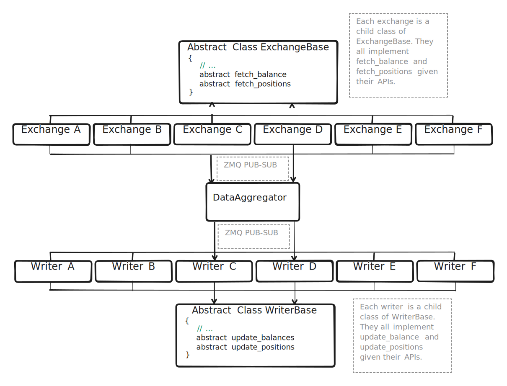

# Enigma Capital - The Modern Intelligent Investor

**A modular financial assistant: run your investments in the background.**

## What is Enigma Capital?

Enigma Capital observes two use-cases. It functions as both a [Financial Assistant](#a-financial-assistant) and a [Developer Skills Enhancer](#a-contributor-friendly-developer-skills-honer).

### A Financial Assistant:

This repository allows you to run your finances in the background, freeing you to do _anything_ else. Current features include:

- Monitoring and saving your positions and balances across crypto and traditional exchanges;
- Conducting analysis on collected data;
- Building and tracking performance records;
- Quantifying investment theses, creating dashboards, and delivering them to your chosen Telegram channel.

<details>
  <summary><strong>Supported Exchanges</strong></summary>

  - Binance;
  - Bybit;
  - DYDX; 
  - Ethereum; 
  - Interactive Brokers; 
  - TradeStation;
  - FTX;
  - Kraken;
  - RootStock;

</details>

### A Contributor-Friendly, Developer Skills Enhancer:

The [Account Data Fetcher](./account_data_fetcher/) follows a modular architecture:



Adding new components is straightforward—simply extend the existing base classes. The codebase uses verbose, Google-style docstrings for clarity and is filled with [To-dos](#todos) to guide contributors who are uncertain where to begin.

## Installation

1. **Install virtualenv**:
```bash
sudo pip install virtualenv
```
2. **Clone the repo or a fork of it**
3. **Navigate to the base repo directory and run**:
```bash
virtualenv env
```
4. **Activate your virtual environment**: 
```bash
source env/bin/activate
```
5. **Install the requirements**: 
```bash
pip install -r requirements.txt
```
6. **Install Rust for the cryptography library**: 
```bash
curl --proto '=https' --tlsv1.2 -sSf https://sh.rustup.rs | sh
```
7. **Generate a Private Key**:   
Create a private key using `encryptor.py` in `/utilities` (with a password!). The project looks for private keys in both `./account_data_fetcher/secrets/` and `./monitor/` directories. Run the below in both directories to set-up your `./pk.txt`:  
- From `./monitor`:
```bash
python3 ../utilities/encryptor.py
```
- and from `./account_data_fetcher/secrets/`:
```bash
python3 ../../utilities/encryptor.py
```

8. **Set API Keys**:  
Use `encryptor.py` with the function `write_api_key_enc_to_file`, then add additional keys using `add_keys_to_encrypted_file`. Use the following pattern, and source "Other_fields" informations from [here](./account_data_fetcher/secrets/example_.api_enc.py)
```python
key_information = {
"Key": "",
"Secret": "",
"Other_fields": {}
}
```
9. **Create an Encrypted `.gsheet.txt` File**:  
If using gsheet as write parameters, obtain JSON from Google (cf [tutorial](https://medium.com/craftsmenltd/from-csv-to-google-sheet-using-python-ef097cb014f9))
10. **Thesis Monitoring Setup**:  
Repeat steps 6 and 7 in the `/thesis_monitoring` directory.
11. **Run the Scripts**:   
You may need to make the script executable first:
```bash
chmod+x scriptname.sh
```
Run the scripts. To move them to the background after entering your password, press `CTRL+z`, then run `bg`. `disown` if needed.

---


For those needing higher frequency than daily data, use the IBC gateway. Raspberry Pi users, take note: this is currently not possible for you. If you're inexperienced, I wouldn't recommend using the below.

**IBC requirements**:

- [Install Offline TWS](https://www.interactivebrokers.com/en/trading/tws-offline-installers.php)

- [Download IBC](https://github.com/IbcAlpha/IBC/releases)
- iI `java -version` returns nothing, install Java:
```bash
sudo apt install default-jdk
```

**On Unix**:  

1. **Unzip the File**:  
Unpack the ZIP file with the following command
```
sudo unzip ~/Downloads/IBCLinux-3.6.0.zip -d /opt/ibc
```
2. **Set File Permissions**:  
Ensure all script files are executable
```
cd /opt/ibc
sudo chmod o+x *.sh */*.sh
```
3. **Check Version**:  
Verify the major version number for TWS in the shell scripts located in the IBC folder. Files to check:
- Windows: `StartTWS.bat`, `StartGateway.bat`
- Unix: `twsstart.sh`, `gatewaystart.sh`
- macOS: `twsstartmacos.sh`, `gatewaystartmacos.sh`

3. **Find Major Version Number**:  

Run TWS or the Gateway manually through the IBKR-provided icon. Navigate to *Help* > *About Trader Workstation* or *Help* > *About IB Gateway*. Look for a line like:
```
   Build 10.19.1f, Oct 28, 2022 3:03:08 PM
```
- Windows/Linux: Major version is 1019 (ignore the period)
- MacOS: Major version is 10.19

4. **Edit Scripts**:    
Open the script files and make sure the *TWS_MAJOR_VRSN* variable is set correctly.

5. **Set Environment Variable**:    
For zsh shells, add *ENIGMA* as an environment variable:
```
echo 'export ENIGMA=~/Documents/dev/enigma_capital ' >> ~/.zshenv`
```     
    
 
 ## TODOs
- Only localhost is supported for components communication. Allow support for other hosts! ([source](https://github.com/SFYLL/enigma_capital/blob/master/account_data_fetcher/data_aggregator/data_aggregator.py#L226))
- Be able to subscribe to different topics, so that the data_aggregator can scale easily to more usecases ([source](https://github.com/SFYLL/enigma_capital/blob/master/account_data_fetcher/data_aggregator/data_aggregator.py#L287))
- Handle failure. What if an exchange stop publishing and we just loop forever? ([source](https://github.com/SFYLL/enigma_capital/blob/master/account_data_fetcher/data_aggregator/data_aggregator.py#L292))
- Make the function more modular, the data_aggregator should be agnostic to what data is being aggregated as that should be abstracted away. ([source](https://github.com/SFYLL/enigma_capital/blob/master/account_data_fetcher/data_aggregator/data_aggregator.py#L293))
- Properly parse the object below so that the inner dataclass can be read as a dataclass, and not accessed as a dict ([source](https://github.com/SFYLL/enigma_capital/blob/master/account_data_fetcher/data_aggregator/data_aggregator.py#L319))
- For now, we only enforce two methods implementation, namely fetch_balance and fetch_positions. As such, process_request is quite statically defined as well. How could we untangle both so that we can define more abstract methods and have the process_request understands what to fetch dynamically. ([source](https://github.com/SFYLL/enigma_capital/blob/master/account_data_fetcher/exchanges/exchange_base.py#L12))
- Batch calls via multicall contracts + use helios lightweight client (need to fix eth_call loops, broken atm) ([source](https://github.com/SFYLL/enigma_capital/blob/master/account_data_fetcher/exchanges/ethereum/data_fetcher.py#L42))
- Fetch positions ([source](https://github.com/SFYLL/enigma_capital/blob/master/account_data_fetcher/exchanges/ib_async/data_fetcher.py#L49))
- Fix arbitrary ConnectionResetError bug requests.exceptions.ConnectionError: ('Connection aborted.', ConnectionResetError(104, 'Connection reset by peer')) ([source](https://github.com/SFYLL/enigma_capital/blob/master/account_data_fetcher/exchanges/dydx/data_fetcher.py#L65))
- Handle subscription on per topic basis ([source](https://github.com/SFYLL/enigma_capital/blob/master/account_data_fetcher/writers/writer_base.py#L100))
- For the bravest, automate the below by listening to withdraw/deposits for each exchanges and updating the database as needed. ([source](https://github.com/SFYLL/enigma_capital/blob/master/account_data_fetcher/writers/deposit_and_withdraw_handler.py#L58))
- Process request is the only entry-point at the factory level. This could be made more generic to accomodate for other entry-points and inputs as the application scales. ([source](https://github.com/SFYLL/enigma_capital/blob/master/account_data_fetcher/launcher/process_factory_base.py#L43))
- Take a look at account_data_fetcher, how could you refactor the entire monitor component? ([source](https://github.com/SFYLL/enigma_capital/blob/master/monitor/runner.py#L20))
- Format for phone recipient ! ([source](https://github.com/SFYLL/enigma_capital/blob/master/monitor/portfolio_monitor/netliq_to_telegram.py#L12))